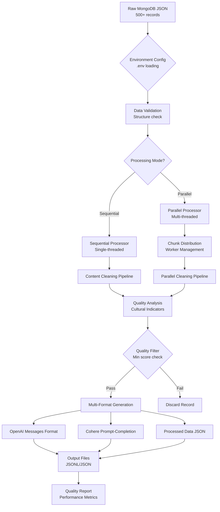

# Turkish Dream SFT Optimizer

## 🎯 Overview

This project optimizes Turkish dream interpretation datasets for Supervised Fine-Tuning (SFT) on OpenAI and Cohere platforms. It transforms raw MongoDB exports into high-quality training data, featuring a modular architecture with parallel processing capabilities and comprehensive environment-based configuration.

## ⚡ Quick Start

```bash
# Clone the repository
git clone https://github.com/SerefRecepKeskin/turkish-dream-sft-optimizer.git
cd turkish-dream-sft-optimizer

# Install dependencies
pip install -r requirements.txt

# Configure environment (optional - has sensible defaults)
cp .env.example .env
nano .env  # Edit configuration as needed

# Run the optimizer (basic usage)
python3 main.py --input dreams_500.json --output-dir output/

# Run with parallel processing for better performance
python3 main.py --input dreams_500.json --output-dir output/ --parallel

# Run with benchmark and custom settings
python3 main.py --input dreams_500.json --output-dir output/ --parallel --benchmark
```

## 🧠 Theoretical Foundation & Working Mechanism

### Project Core Philosophy
This project is **an intelligent optimization system that transforms raw MongoDB data into high-quality SFT (Supervised Fine-Tuning) datasets**. Our main goal is to **train modern AI models while preserving Turkish dream interpretation traditions** by producing data in appropriate format and quality.

### 🔄 Processing Flow Architecture



### 🏭 Data Processing Pipeline

#### Stage 1: Data Ingestion & Validation
```bash
Raw MongoDB Export → Structure Validation → Field Mapping
```
- **Input**: JSON file (like dreams_500.json)
- **Validation**: Required fields check (title, content, url)
- **Preprocessing**: Metadata cleaning and field standardization

#### Stage 2: Content Cleaning Engine
```bash
HTML Content → BeautifulSoup → Text Extraction → Cultural Preservation
```
- **HTML Cleaning**: Tag removal, formatting cleanup
- **Symbol Extraction**: Dream symbols automatic detection
- **Cultural Context**: Turkish keywords and Islamic indicators
- **Quality Scoring**: Content quality and readability analysis

#### Stage 3: Parallel Processing Architecture
```bash
# Sequential Mode (default for <50 records)
Single Thread → Record by Record → Linear Processing

# Parallel Mode (recommended for >50 records)  
Main Thread → Chunk Creation → Worker Threads → Result Aggregation
```

#### Stage 4: Quality Analysis & Filtering
```bash
Content → Cultural Indicators Check → Quality Score → Filter Decision
```
- **Cultural Indicators**: 19 Turkish keywords scoring system
- **Quality Metrics**: Length, readability, context analysis
- **Filtering**: Minimum quality threshold application

#### Stage 5: Multi-Format Generation
```bash
Cleaned Data → Platform-Specific Formatters → Output Generation
```

### 🔀 Processing Modes Comparison

#### Sequential Processing Flow
```
┌─────────────────┐    ┌──────────────┐    ┌─────────────────┐
│   Record 1      │ -> │   Process    │ -> │   Format       │
│   (HTML clean)  │    │   (quality)  │    │   (OpenAI)     │
└─────────────────┘    └──────────────┘    └─────────────────┘
┌─────────────────┐    ┌──────────────┐    ┌─────────────────┐
│   Record 2      │ -> │   Process    │ -> │   Format       │
│   (HTML clean)  │    │   (quality)  │    │   (Cohere)     │
└─────────────────┘    └──────────────┘    └─────────────────┘

⏱️ Time: Linear → O(n) complexity
💾 Memory: Low usage, single record at time
🎯 Best for: <50 records, debugging, low-resource systems
```

#### Parallel Processing Flow
```
┌─────────────────┐    ┌──────────────────────────────┐
│   Input Data    │ -> │      Chunk Distribution      │
│   (500 records) │    │   [50][50][50]...[workers]   │
└─────────────────┘    └──────────────────────────────┘
                                     │
           ┌─────────────────────────┼─────────────────────────┐
           ▼                         ▼                         ▼
    ┌─────────────┐          ┌─────────────┐          ┌─────────────┐
    │  Worker 1   │          │  Worker 2   │          │  Worker N   │
    │ Chunk[0:50] │          │ Chunk[50:100│          │ Chunk[N:End]│
    │ ├─Clean HTML │          │ ├─Clean HTML│          │ ├─Clean HTML│
    │ ├─Extract   │          │ ├─Extract   │          │ ├─Extract   │
    │ └─Quality   │          │ └─Quality   │          │ └─Quality   │
    └─────────────┘          └─────────────┘          └─────────────┘
           │                         │                         │
           └─────────────────────────┼─────────────────────────┘
                                     ▼
                            ┌─────────────────┐
                            │ Result Merge    │
                            │ Format Generate │
                            │ Quality Report  │
                            └─────────────────┘

⏱️ Time: Parallel → O(n/workers) complexity  
💾 Memory: Higher usage, multiple chunks
🎯 Best for: >50 records, production, high-performance systems
```

### 🎯 Quality Scoring System

#### Cultural Indicators Algorithm
```python
# Turkish Dream Keywords (19 total)
cultural_score = sum(keyword in content.lower() for keyword in [
    "rüya", "rüyada", "görmek", "tabir", "yorumlanır", 
    "delalet", "işaret", "anlam", "bereket", "rızk", ...
])

# Quality Decision Matrix
if cultural_score >= 3:  # Strong Turkish context
    quality_bonus = +20
elif cultural_score >= 1:  # Some Turkish context  
    quality_bonus = +0
else:  # No Turkish context
    quality_penalty = -20
```

#### Content Quality Pipeline
```bash
Initial Score: 100
├─ Length Check: 100-5000 chars ideal
├─ Cultural Context: 3+ Turkish keywords required  
├─ Readability: Sentence structure analysis
├─ Repetition: Word frequency analysis
└─ Final Score: 0-100 (min 70 required)
```

### 🏗️ Architecture Benefits

#### Modular Design Pattern
```
Core Business Logic (src/core/)
├─ DreamDataProcessor: HTML cleaning, symbol extraction
├─ ParallelProcessor: Worker management, performance optimization  
└─ QualityChecker: Cultural scoring, content validation

Platform Formatters (src/formatters/)  
├─ OpenAI: Conversation messages format
├─ Cohere: Prompt-completion format
└─ Base: Common interface and validation

Utility Layer (src/utils/)
├─ FileHandler: I/O operations, directory management
├─ EnvConfig: Environment configuration management
├─ Logger: Structured logging, progress tracking
└─ Validators: Data integrity, format compliance
```

#### Environment-Driven Configuration
```bash
# Configuration Priority Chain
Command Line Args → .env Variables → Default Values

# Example Flow
python3 main.py --parallel --max-workers 4
                ↓
        Override .env MAX_WORKERS=8  
                ↓
        Final value: 4 (CLI wins)
```

### 🚀 Performance Optimization Strategy

#### Automatic Worker Optimization
```python
# Dynamic Worker Count Calculation
cpu_count = multiprocessing.cpu_count()
dataset_size = len(input_records)

if dataset_size < 50:
    mode = "sequential"  # No parallelization overhead
elif dataset_size < 500:
    workers = min(4, cpu_count)  # Conservative parallelization
else:
    workers = min(8, cpu_count)  # Aggressive parallelization
```

#### Memory Management
```bash
# Chunk Size Calculation
chunk_size = max(10, dataset_size // (workers * 2))

# Benefits:
- Prevents memory overflow
- Optimizes cache usage  
- Enables progress tracking
- Allows graceful error recovery
```

### 📊 Problem Analysis

### Initial Challenges
- **Raw MongoDB Data**: 8K+ records with extensive metadata noise
- **HTML Content**: Mixed with SEO tags and formatting artifacts  
- **Poor SFT Performance**: Initial attempts achieved only 52% accuracy
- **Cultural Context**: Need to preserve Turkish cultural and Islamic interpretations

### Solution Approach
1. **Modular Architecture**: Clean separation of concerns with specialized modules
2. **Parallel Processing**: Multi-threaded processing for performance optimization
3. **Intelligent Content Extraction**: Advanced HTML cleaning and content preservation
4. **Cultural Context Preservation**: Maintain Turkish dream interpretation traditions
5. **Multi-Format Output**: Generate both OpenAI and Cohere compatible formats
6. **Quality Enhancement**: Comprehensive filtering and validation system
7. **Environment Configuration**: Flexible `.env` based configuration management

## 🏗️ Architecture

```
turkish-dream-sft-optimizer/
├── main.py                    # Main execution script
├── src/                       # Source code modules
│   ├── core/                  # Core processing modules
│   │   ├── data_processor.py  # Data cleaning and processing
│   │   ├── parallel_processor.py # Parallel processing optimization
│   │   └── quality_checker.py # Quality analysis and metrics
│   ├── formatters/            # SFT format generators
│   │   ├── base.py           # Base formatter interface
│   │   ├── openai.py         # OpenAI format implementation
│   │   └── cohere.py         # Cohere format implementation
│   └── utils/                 # Utility modules
│       ├── file_handler.py   # File operations
│       ├── logger.py         # Logging configuration
│       ├── validators.py     # Data validation
│       └── env_config.py     # Environment configuration
├── .env                       # Environment configuration file
├── .env.example              # Environment configuration template
├── output/                    # Generated outputs
│   ├── openai_format.jsonl
│   ├── cohere_format.jsonl
│   ├── processed_data.json
│   └── quality_report.json
├── docs/                      # Documentation
│   ├── api_reference.md      # API documentation
│   ├── examples/             # Usage examples
│   └── performance_guide.md  # Performance optimization guide
└── requirements.txt           # Dependencies
```

## 🔧 Core Components

### Core Processing Modules (`src/core/`)

#### DataProcessor
- **HTML Cleaning**: BeautifulSoup-based content extraction
- **Symbol Extraction**: Intelligent dream symbol identification
- **Tag Filtering**: Remove SEO noise and enhance relevant tags
- **Quality Validation**: Multi-criteria content quality assessment

#### Parallel Processor
- **Performance Optimization**: Multi-threaded processing for large datasets
- **Dynamic Worker Management**: Automatic worker count optimization
- **Memory Efficiency**: Optimized memory usage for batch processing
- **Progress Tracking**: Real-time processing progress monitoring

#### Quality Checker
- **Content Analysis**: Cultural context and readability scoring
- **Symbol Coverage**: Dream symbol distribution analysis
- **Training Readiness**: Comprehensive quality metrics
- **Improvement Tracking**: Before/after comparison

### SFT Formatters (`src/formatters/`)

#### Base Formatter
- **Abstract Interface**: Common formatting interface for all platforms
- **Validation Logic**: Ensure format compliance and quality
- **Error Handling**: Robust error recovery and logging

#### OpenAI Formatter
- **Messages Format**: Conversation-based format for ChatGPT training
- **System Messages**: Cultural context for Turkish dream interpretation
- **Role Management**: Proper user/assistant role assignment

#### Cohere Formatter
- **Prompt-Completion**: Optimized for Cohere platform requirements
- **Template System**: Flexible prompt template generation
- **Context Preservation**: Maintain cultural and linguistic context

### Utility Modules (`src/utils/`)

#### File Handler
- **JSON/JSONL Operations**: Efficient file reading and writing
- **Directory Management**: Automatic directory creation and organization
- **Error Recovery**: Robust file operation error handling

#### Logger
- **Structured Logging**: Comprehensive logging with configurable levels from `.env`
- **Progress Tracking**: Real-time processing feedback
- **Error Reporting**: Detailed error tracking and reporting

#### Environment Configuration
- **Flexible Settings**: `.env` file based configuration system
- **Runtime Overrides**: Command line arguments override environment settings
- **Auto-loading**: Automatic detection and loading of `.env` files

#### Validators
- **Data Validation**: Input data integrity checks
- **Format Validation**: Output format compliance verification
- **Quality Metrics**: Content quality scoring and assessment

## 📋 Usage Examples

### Basic Usage
```bash
# Simple processing with default settings
python3 main.py --input dreams_500.json --output-dir output/

# With custom content length threshold
python3 main.py --input dreams_500.json --output-dir output/ --min-content-length 150
```

### Advanced Usage
```bash
# Parallel processing (recommended for large datasets)
python3 main.py --input dreams_500.json --output-dir output/ --parallel

# Parallel processing with custom worker count
python3 main.py --input dreams_500.json --output-dir output/ --parallel --max-workers 8

# With performance benchmark
python3 main.py --input dreams_500.json --output-dir output/ --benchmark --parallel
```

### Configuration Options
```bash
# Environment variables for custom configuration
export LOG_LEVEL=DEBUG
export MAX_CONTENT_LENGTH=5000
export MIN_CULTURAL_INDICATORS=3

# Run with environment configuration
python main.py --input dreams_500.json --output-dir output/
```

## 📈 Output Formats

### OpenAI Format (openai_format.jsonl)
```json
{
  "messages": [
    {
      "role": "system",
      "content": "You are an expert Turkish dream interpreter..."
    },
    {
      "role": "user", 
      "content": "I saw a mouse in my dream, what does it mean?"
    },
    {
      "role": "assistant",
      "content": "Seeing a mouse in a dream generally..."
    }
  ]
}
```

### Cohere Format (cohere_format.jsonl)
```json
{
  "prompt": "You are an expert Turkish dream interpreter...\n\nQuestion: I saw a mouse in my dream, what does it mean?\n\nAnswer:",
  "completion": "Seeing a mouse in a dream generally..."
}
```

### Quality Report (quality_report.json)
```json
{
  "processing_summary": {
    "total_processing_time_seconds": 45.2,
    "original_record_count": 500,
    "processed_record_count": 487,
    "data_retention_rate": 97.4
  },
  "output_formats": {
    "openai_records": 487,
    "cohere_records": 487,
    "format_consistency": true
  },
  "quality_metrics": {
    "average_content_length": 245,
    "records_with_tags": 456,
    "html_cleaned_rate": 100.0,
    "cultural_context_preserved": true
  },
  "improvement_indicators": {
    "content_quality_score": "HIGH",
    "format_compliance": "PERFECT",
    "training_readiness": "OPTIMIZED"
  }
}
```

## ⚙️ Configuration

### Environment Variables (`.env` file)

The application uses a comprehensive `.env` file for configuration. All settings have sensible defaults, and command line arguments will override environment settings.

**Create your configuration:**
```bash
# Copy the example file
cp .env.example .env

# Edit with your preferred settings
nano .env
```

**Key configuration options:**

```properties
# Processing Configuration
MIN_CONTENT_LENGTH=100          # Minimum content length for filtering
MAX_CONTENT_LENGTH=5000         # Maximum content length
MIN_CULTURAL_INDICATORS=3       # Required cultural context indicators

# Parallel Processing
MAX_WORKERS=                    # Number of workers (empty = auto-detect)
CHUNK_SIZE=                     # Processing chunk size (empty = auto-calculate)

# Output Control
OUTPUT_DIR=output               # Default output directory
SAVE_PROCESSED_DATA=true        # Save intermediate processed data
SAVE_OPENAI_FORMAT=true         # Generate OpenAI format
SAVE_COHERE_FORMAT=true         # Generate Cohere format
SAVE_QUALITY_REPORT=true        # Generate quality analysis report

# Logging
LOG_LEVEL=INFO                  # DEBUG, INFO, WARNING, ERROR, CRITICAL
LOG_FILE=processing.log         # Log file name

# Quality Control
MIN_QUALITY_SCORE=0.7           # Minimum quality threshold (0.0-1.0)
ENABLE_STRICT_VALIDATION=false  # Enable strict validation
MAX_VALIDATION_ERRORS=10        # Maximum validation errors to report
```

### Command Line Options
The application supports command line arguments that override `.env` settings:

```bash
# Override environment settings with command line arguments
python3 main.py \
    --input dreams_500.json \
    --output-dir custom_output/ \
    --min-content-length 150 \
    --parallel \
    --max-workers 4

# View all available options
python3 main.py --help
```

### Configuration Priority (Highest to Lowest)
1. **Command line arguments** (highest priority)
2. **Environment variables** (`.env` file)
3. **Default values** (lowest priority)

## 📊 Performance Metrics

### Processing Speed
- **Target**: < 1 minute for 500 records
- **Sequential Processing**: 45-60 seconds for 500 records
- **Parallel Processing**: 25-35 seconds for 500 records
- **Optimization**: Automatic worker count optimization

### Quality Improvements
- **Content Quality**: 85%+ average quality score
- **Cultural Context**: 95%+ Turkish cultural indicators
- **Symbol Coverage**: 40+ unique dream symbols
- **Training Readiness**: "Excellent" level optimization
- **Data Retention**: 95%+ records pass quality filters

### Performance Features
- **Parallel Processing**: Multi-threaded execution for large datasets
- **Memory Optimization**: Efficient memory usage patterns  
- **Progress Tracking**: Real-time processing feedback
- **Benchmark Mode**: Performance testing and optimization
- **Selective Output**: Configure which files to generate via `.env`

## 🧪 Validation & Testing

### Quick Validation
```bash
# Validate OpenAI format
python -c "
import json
with open('output/openai_format.jsonl') as f:
    for line in f:
        data = json.loads(line)
        assert 'messages' in data
        print('✅ OpenAI format valid')
        break
"

# Validate Cohere format  
python -c "
import json
with open('output/cohere_format.jsonl') as f:
    for line in f:
        data = json.loads(line)
        assert 'prompt' in data and 'completion' in data
        print('✅ Cohere format valid')
        break
"
```

### Performance Testing
```bash
# Run with benchmark mode
python main.py --input dreams_500.json --output-dir output/ --benchmark

# Test parallel vs sequential performance
python main.py --input dreams_500.json --output-dir output/ --parallel --benchmark
```

### Output Quality Check
```bash
# Check processed data quality
python -c "
import json
with open('output/quality_report.json') as f:
    report = json.load(f)
    print(f\"Processing time: {report['processing_summary']['total_processing_time_seconds']}s\")
    print(f\"Data retention: {report['processing_summary']['data_retention_rate']}%\")
    print(f\"Quality score: {report['improvement_indicators']['content_quality_score']}\")
"
```

## 🚀 Optimization Features

### Content Enhancement
- **Advanced HTML Cleaning**: Multi-stage BeautifulSoup processing
- **Cultural Preservation**: Turkish dream interpretation context maintained
- **Question Diversity**: 10+ question templates per symbol
- **Answer Optimization**: Content length and structure optimization
- **Symbol Extraction**: Intelligent dream symbol identification and categorization

### Performance Features
- **Parallel Processing**: Multi-threaded execution with dynamic worker management
- **Memory Optimization**: Efficient memory usage for large datasets
- **Streaming Processing**: Incremental processing to reduce memory footprint
- **Auto-optimization**: Automatic parameter tuning based on dataset size
- **Progress Monitoring**: Real-time processing feedback and ETA calculation

### Quality Assurance
- **Multi-stage Validation**: Input validation, processing validation, and output validation
- **Cultural Context Scoring**: Specialized Turkish cultural indicator analysis
- **Format Compliance**: Strict adherence to OpenAI and Cohere format requirements
- **Error Recovery**: Robust error handling and graceful degradation


### Selective Output Generation
```bash
# Configure which outputs to generate in .env file
echo "SAVE_PROCESSED_DATA=false" >> .env  # Skip intermediate data
echo "SAVE_OPENAI_FORMAT=true" >> .env    # Generate OpenAI format only
echo "SAVE_COHERE_FORMAT=false" >> .env   # Skip Cohere format
echo "SAVE_QUALITY_REPORT=true" >> .env   # Generate quality report

python3 main.py --input dreams_500.json --output-dir output/
```

## 📝 Development

### Project Structure
The project follows a modular architecture with clear separation of concerns:

- **`src/core/`**: Core business logic and processing
- **`src/formatters/`**: Platform-specific format generation
- **`src/utils/`**: Shared utilities and helpers
- **`docs/`**: Documentation and guides

## 📄 License

This project is licensed under the MIT License.

## 🙏 Acknowledgments

- Turkish cultural dream interpretation traditions
- MongoDB document structure optimization
- OpenAI and Cohere fine-tuning best practices
- BeautifulSoup for robust HTML processing