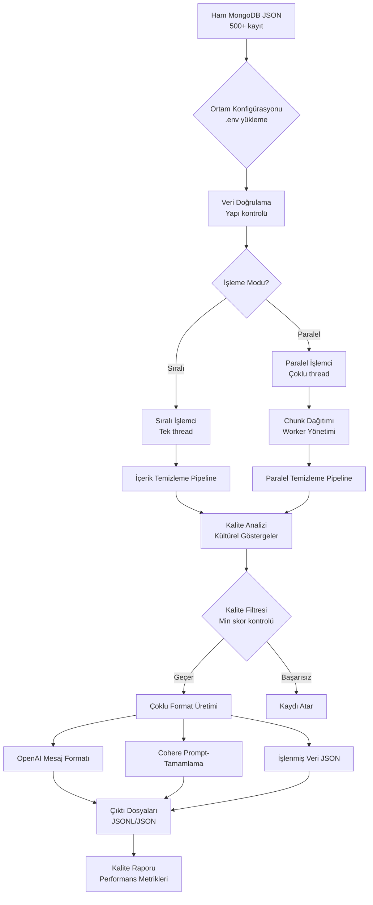

# Türk Rüya SFT Optimizer

## 🎯 Genel Bakış

Bu proje, Türk rüya yorumu veri setlerini OpenAI ve Cohere platformları için Supervised Fine-Tuning (SFT) optimizasyonu yapar. Ham MongoDB çıktılarını yüksek kaliteli eğitim verisine dönüştürür, modüler mimari ile paralel işleme yetenekleri ve kapsamlı ortam tabanlı konfigürasyon sunar.

## ⚡ Hızlı Başlangıç

```bash
# Depoyu klonlayın
git clone https://github.com/SerefRecepKeskin/turkish-dream-sft-optimizer.git
cd turkish-dream-sft-optimizer

# Bağımlılıkları yükleyin
pip install -r requirements.txt

# Ortamı yapılandırın (isteğe bağlı - mantıklı varsayılanlar var)
cp .env.example .env
nano .env  # Gerektiğinde konfigürasyonu düzenleyin

# Optimizer'ı çalıştırın (temel kullanım)
python3 main.py --input dreams_500.json --output-dir output/

# Daha iyi performans için paralel işleme ile çalıştırın
python3 main.py --input dreams_500.json --output-dir output/ --parallel

# Benchmark ve özel ayarlarla çalıştırın
python3 main.py --input dreams_500.json --output-dir output/ --parallel --benchmark
```

## 🧠 Teorik Temel ve Çalışma Mekanizması

### Proje Temel Felsefesi
Bu proje **ham MongoDB verilerini yüksek kaliteli SFT (Supervised Fine-Tuning) veri setine dönüştüren** akıllı bir optimizasyon sistemidir. Temel amacımız **Türk rüya yorumu geleneğini koruyarak** modern AI modellerini eğitmek için uygun format ve kalitede veri üretmektir.

### 🔄 İşleme Akış Mimarisi



### 🏭 Veri İşleme Pipeline

#### Aşama 1: Veri Alımı ve Doğrulama
```bash
Ham MongoDB Çıktısı → Yapı Doğrulama → Alan Eşleştirme
```
- **Girdi**: JSON dosyası (dreams_500.json gibi)
- **Doğrulama**: Gerekli alanların kontrolü (title, content, url)
- **Ön işleme**: Meta veri temizliği ve alan standardizasyonu

#### Aşama 2: İçerik Temizleme Motoru
```bash
HTML İçerik → BeautifulSoup → Metin Çıkarma → Kültürel Koruma
```
- **HTML Temizleme**: Tag kaldırma, format temizliği
- **Sembol Çıkarma**: Rüya sembollerinin otomatik tespiti
- **Kültürel Bağlam**: Türkçe anahtar kelimeler ve İslami göstergeler
- **Kalite Puanlama**: İçerik kalitesi ve okunabilirlik analizi

#### Aşama 3: Paralel İşleme Mimarisi
```bash
# Sıralı Mod (50 kayıttan az için varsayılan)
Tek Thread → Kayıt Kayıt → Doğrusal İşleme

# Paralel Mod (50+ kayıt için önerilen)  
Ana Thread → Chunk Oluşturma → Worker Thread'ler → Sonuç Birleştirme
```

#### Aşama 4: Kalite Analizi ve Filtreleme
```bash
İçerik → Kültürel Gösterge Kontrolü → Kalite Puanı → Filtre Kararı
```
- **Kültürel Göstergeler**: 19 Türkçe anahtar kelime puanlama sistemi
- **Kalite Metrikleri**: Uzunluk, okunabilirlik, bağlam analizi
- **Filtreleme**: Minimum kalite eşiği uygulaması

#### Aşama 5: Çoklu Format Üretimi
```bash
Temizlenmiş Veri → Platform-Özel Formatlayıcılar → Çıktı Üretimi
```

### 🔀 İşleme Modları Karşılaştırması

#### Sıralı İşleme Akışı
```
┌─────────────────┐    ┌──────────────┐    ┌─────────────────┐
│   Kayıt 1       │ -> │   İşle       │ -> │   Formatla     │
│   (HTML temiz)  │    │   (kalite)   │    │   (OpenAI)     │
└─────────────────┘    └──────────────┘    └─────────────────┘
┌─────────────────┐    ┌──────────────┐    ┌─────────────────┐
│   Kayıt 2       │ -> │   İşle       │ -> │   Formatla     │
│   (HTML temiz)  │    │   (kalite)   │    │   (Cohere)     │
└─────────────────┘    └──────────────┘    └─────────────────┘

⏱️ Zaman: Doğrusal → O(n) karmaşıklığı
💾 Bellek: Düşük kullanım, aynı anda tek kayıt
🎯 En iyi: <50 kayıt, hata ayıklama, düşük kaynak sistemleri
```

#### Paralel İşleme Akışı
```
┌─────────────────┐    ┌──────────────────────────────┐
│   Girdi Verisi  │ -> │      Chunk Dağıtımı         │
│   (500 kayıt)   │    │   [50][50][50]...[worker'lar]│
└─────────────────┘    └──────────────────────────────┘
                                     │
           ┌─────────────────────────┼─────────────────────────┐
           ▼                         ▼                         ▼
    ┌─────────────┐          ┌─────────────┐          ┌─────────────┐
    │  Worker 1   │          │  Worker 2   │          │  Worker N   │
    │ Chunk[0:50] │          │ Chunk[50:100│          │ Chunk[N:Son]│
    │ ├─HTML Temiz│          │ ├─HTML Temiz│          │ ├─HTML Temiz│
    │ ├─Çıkarım   │          │ ├─Çıkarım   │          │ ├─Çıkarım   │
    │ └─Kalite    │          │ └─Kalite    │          │ └─Kalite    │
    └─────────────┘          └─────────────┘          └─────────────┘
           │                         │                         │
           └─────────────────────────┼─────────────────────────┘
                                     ▼
                            ┌─────────────────┐
                            │ Sonuç Birleştir │
                            │ Format Üret     │
                            │ Kalite Raporu   │
                            └─────────────────┘

⏱️ Zaman: Paralel → O(n/worker'lar) karmaşıklığı  
💾 Bellek: Yüksek kullanım, çoklu chunk'lar
🎯 En iyi: >50 kayıt, prodüksiyon, yüksek performans sistemleri
```

### 🎯 Kalite Puanlama Sistemi

#### Kültürel Göstergeler Algoritması
```python
# Türkçe Rüya Anahtar Kelimeleri (19 toplam)
cultural_score = sum(keyword in content.lower() for keyword in [
    "rüya", "rüyada", "görmek", "tabir", "yorumlanır", 
    "delalet", "işaret", "anlam", "bereket", "rızk", ...
])

# Kalite Karar Matrisi
if cultural_score >= 3:  # Güçlü Türkçe bağlam
    quality_bonus = +20
elif cultural_score >= 1:  # Biraz Türkçe bağlam  
    quality_bonus = +0
else:  # Türkçe bağlam yok
    quality_penalty = -20
```

#### İçerik Kalite Pipeline
```bash
Başlangıç Puanı: 100
├─ Uzunluk Kontrolü: 100-5000 karakter ideal
├─ Kültürel Bağlam: 3+ Türkçe anahtar kelime gerekli  
├─ Okunabilirlik: Cümle yapısı analizi
├─ Tekrar: Kelime sıklığı analizi
└─ Nihai Puan: 0-100 (min 70 gerekli)
```

### 🏗️ Mimari Avantajları

#### Modüler Tasarım Deseni
```
Temel İş Mantığı (src/core/)
├─ DreamDataProcessor: HTML temizleme, sembol çıkarma
├─ ParallelProcessor: Worker yönetimi, performans optimizasyonu  
└─ QualityChecker: Kültürel puanlama, içerik doğrulama

Platform Formatlayıcıları (src/formatters/)  
├─ OpenAI: Konuşma mesaj formatı
├─ Cohere: Prompt-tamamlama formatı
└─ Base: Ortak arayüz ve doğrulama

Yardımcı Katman (src/utils/)
├─ FileHandler: I/O işlemleri, dizin yönetimi
├─ EnvConfig: Ortam konfigürasyon yönetimi
├─ Logger: Yapılandırılmış loglama, ilerleme takibi
└─ Validators: Veri bütünlüğü, format uyumluluğu
```

#### Ortam Güdümlü Konfigürasyon
```bash
# Konfigürasyon Öncelik Zinciri
Komut Satırı Argümanları → .env Değişkenleri → Varsayılan Değerler

# Örnek Akış
python3 main.py --parallel --max-workers 4
                ↓
        .env MAX_WORKERS=8'i geçersiz kıl  
                ↓
        Nihai değer: 4 (CLI kazanır)
```

### 🚀 Performans Optimizasyon Stratejisi

#### Otomatik Worker Optimizasyonu
```python
# Dinamik Worker Sayısı Hesaplama
cpu_count = multiprocessing.cpu_count()
dataset_size = len(input_records)

if dataset_size < 50:
    mode = "sequential"  # Paralelleştirme yükü yok
elif dataset_size < 500:
    workers = min(4, cpu_count)  # Konservatif paralelleştirme
else:
    workers = min(8, cpu_count)  # Agresif paralelleştirme
```

#### Bellek Yönetimi
```bash
# Chunk Boyut Hesaplama
chunk_size = max(10, dataset_size // (workers * 2))

# Faydalar:
- Bellek taşmasını önler
- Cache kullanımını optimize eder  
- İlerleme takibini etkinleştirir
- Zarif hata kurtarma sağlar
```

### 📊 Problem Analizi

### Başlangıç Zorlukları
- **Ham MongoDB Verisi**: Kapsamlı meta veri gürültüsü ile 8K+ kayıt
- **HTML İçerik**: SEO etiketleri ve format yapılarıyla karışık  
- **Zayıf SFT Performansı**: İlk denemeler sadece %52 doğruluk sağladı
- **Kültürel Bağlam**: Türkçe kültürel ve İslami yorumları koruma ihtiyacı

### Çözüm Yaklaşımı
1. **Modüler Mimari**: Özelleşmiş modüllerle endişelerin temiz ayrımı
2. **Paralel İşleme**: Performans optimizasyonu için çoklu thread işleme
3. **Akıllı İçerik Çıkarma**: Gelişmiş HTML temizleme ve içerik koruma
4. **Kültürel Bağlam Koruma**: Türk rüya yorumu geleneklerini sürdürme
5. **Çoklu Format Çıktısı**: Hem OpenAI hem Cohere uyumlu formatlar üretme
6. **Kalite Geliştirme**: Kapsamlı filtreleme ve doğrulama sistemi
7. **Ortam Konfigürasyonu**: Esnek `.env` tabanlı konfigürasyon yönetimi

## 🏗️ Mimari

```
turkish-dream-sft-optimizer/
├── main.py                    # Ana çalıştırma scripti
├── src/                       # Kaynak kod modülleri
│   ├── core/                  # Temel işleme modülleri
│   │   ├── data_processor.py  # Veri temizleme ve işleme
│   │   ├── parallel_processor.py # Paralel işleme optimizasyonu
│   │   └── quality_checker.py # Kalite analizi ve metrikler
│   ├── formatters/            # SFT format üreticileri
│   │   ├── base.py           # Temel formatlayıcı arayüzü
│   │   ├── openai.py         # OpenAI format implementasyonu
│   │   └── cohere.py         # Cohere format implementasyonu
│   └── utils/                 # Yardımcı modüller
│       ├── file_handler.py   # Dosya işlemleri
│       ├── logger.py         # Loglama konfigürasyonu
│       ├── validators.py     # Veri doğrulama
│       └── env_config.py     # Ortam konfigürasyonu
├── .env                       # Ortam konfigürasyon dosyası
├── .env.example              # Ortam konfigürasyon şablonu
├── output/                    # Üretilen çıktılar
│   ├── openai_format.jsonl
│   ├── cohere_format.jsonl
│   ├── processed_data.json
│   └── quality_report.json
├── docs/                      # Dokümantasyon
│   ├── api_reference.md      # API dokümantasyonu
│   ├── examples/             # Kullanım örnekleri
│   └── performance_guide.md  # Performans optimizasyon rehberi
└── requirements.txt           # Bağımlılıklar
```

## 🔧 Temel Bileşenler

### Temel İşleme Modülleri (`src/core/`)

#### DataProcessor
- **HTML Temizleme**: BeautifulSoup tabanlı içerik çıkarma
- **Sembol Çıkarma**: Akıllı rüya sembol tanımlama
- **Etiket Filtreleme**: SEO gürültüsünü kaldır ve ilgili etiketleri geliştir
- **Kalite Doğrulama**: Çoklu kriteryalı içerik kalite değerlendirmesi

#### Parallel Processor
- **Performans Optimizasyonu**: Büyük veri setleri için çoklu thread işleme
- **Dinamik Worker Yönetimi**: Otomatik worker sayısı optimizasyonu
- **Bellek Verimliliği**: Toplu işleme için optimize edilmiş bellek kullanımı
- **İlerleme Takibi**: Gerçek zamanlı işleme ilerleme izleme

#### Quality Checker
- **İçerik Analizi**: Kültürel bağlam ve okunabilirlik puanlama
- **Sembol Kapsamı**: Rüya sembol dağılım analizi
- **Eğitim Hazırlığı**: Kapsamlı kalite metrikleri
- **Gelişim Takibi**: Öncesi/sonrası karşılaştırma

### SFT Formatlayıcıları (`src/formatters/`)

#### Base Formatter
- **Soyut Arayüz**: Tüm platformlar için ortak formatlama arayüzü
- **Doğrulama Mantığı**: Format uyumluluğu ve kaliteyi sağla
- **Hata İşleme**: Sağlam hata kurtarma ve loglama

#### OpenAI Formatter
- **Mesaj Formatı**: ChatGPT eğitimi için konuşma tabanlı format
- **Sistem Mesajları**: Türk rüya yorumu için kültürel bağlam
- **Rol Yönetimi**: Uygun kullanıcı/asistan rol ataması

#### Cohere Formatter
- **Prompt-Tamamlama**: Cohere platform gereksinimleri için optimize
- **Şablon Sistemi**: Esnek prompt şablon üretimi
- **Bağlam Koruma**: Kültürel ve dilsel bağlamı sürdür

### Yardımcı Modüller (`src/utils/`)

#### File Handler
- **JSON/JSONL İşlemleri**: Verimli dosya okuma ve yazma
- **Dizin Yönetimi**: Otomatik dizin oluşturma ve organizasyon
- **Hata Kurtarma**: Sağlam dosya işlemi hata işleme

#### Logger
- **Yapılandırılmış Loglama**: `.env`den yapılandırılabilir seviyelerle kapsamlı loglama
- **İlerleme Takibi**: Gerçek zamanlı işleme geri bildirimi
- **Hata Raporlama**: Detaylı hata takibi ve raporlama

#### Environment Configuration
- **Esnek Ayarlar**: `.env` dosya tabanlı konfigürasyon sistemi
- **Çalışma Zamanı Geçersiz Kılma**: Komut satırı argümanları ortam ayarlarını geçersiz kılar
- **Otomatik Yükleme**: `.env` dosyalarının otomatik algılanması ve yüklenmesi

#### Validators
- **Veri Doğrulama**: Girdi veri bütünlüğü kontrolleri
- **Format Doğrulama**: Çıktı format uyumluluk doğrulama
- **Kalite Metrikleri**: İçerik kalite puanlama ve değerlendirme

## 📋 Kullanım Örnekleri

### Temel Kullanım
```bash
# Varsayılan ayarlarla basit işleme
python3 main.py --input dreams_500.json --output-dir output/

# Özel içerik uzunluğu eşiği ile
python3 main.py --input dreams_500.json --output-dir output/ --min-content-length 150
```

### Gelişmiş Kullanım
```bash
# Paralel işleme (büyük veri setleri için önerilen)
python3 main.py --input dreams_500.json --output-dir output/ --parallel

# Özel worker sayısı ile paralel işleme
python3 main.py --input dreams_500.json --output-dir output/ --parallel --max-workers 8

# Performans benchmark ile
python3 main.py --input dreams_500.json --output-dir output/ --benchmark --parallel
```

### Konfigürasyon Seçenekleri
```bash
# Özel konfigürasyon için ortam değişkenleri
export LOG_LEVEL=DEBUG
export MAX_CONTENT_LENGTH=5000
export MIN_CULTURAL_INDICATORS=3

# Ortam konfigürasyonu ile çalıştır
python main.py --input dreams_500.json --output-dir output/
```

## 📈 Çıktı Formatları

### OpenAI Formatı (openai_format.jsonl)
```json
{
  "messages": [
    {
      "role": "system",
      "content": "Sen uzman bir Türk rüya yorumcususun..."
    },
    {
      "role": "user", 
      "content": "Rüyamda fare gördüm, ne anlama gelir?"
    },
    {
      "role": "assistant",
      "content": "Rüyada fare görmek genellikle..."
    }
  ]
}
```

### Cohere Formatı (cohere_format.jsonl)
```json
{
  "prompt": "Sen uzman bir Türk rüya yorumcususun...\n\nSoru: Rüyamda fare gördüm, ne anlama gelir?\n\nCevap:",
  "completion": "Rüyada fare görmek genellikle..."
}
```

### Kalite Raporu (quality_report.json)
```json
{
  "processing_summary": {
    "total_processing_time_seconds": 45.2,
    "original_record_count": 500,
    "processed_record_count": 487,
    "data_retention_rate": 97.4
  },
  "output_formats": {
    "openai_records": 487,
    "cohere_records": 487,
    "format_consistency": true
  },
  "quality_metrics": {
    "average_content_length": 245,
    "records_with_tags": 456,
    "html_cleaned_rate": 100.0,
    "cultural_context_preserved": true
  },
  "improvement_indicators": {
    "content_quality_score": "YÜKSEK",
    "format_compliance": "MÜKEMMEl",
    "training_readiness": "OPTİMİZE"
  }
}
```

## ⚙️ Konfigürasyon

### Ortam Değişkenleri (`.env` dosyası)

Uygulama kapsamlı konfigürasyon için `.env` dosyası kullanır. Tüm ayarların mantıklı varsayılanları vardır ve komut satırı argümanları ortam ayarlarını geçersiz kılar.

**Konfigürasyonunuzu oluşturun:**
```bash
# Örnek dosyayı kopyalayın
cp .env.example .env

# Tercih ettiğiniz ayarlarla düzenleyin
nano .env
```

**Anahtar konfigürasyon seçenekleri:**

```properties
# İşleme Konfigürasyonu
MIN_CONTENT_LENGTH=100          # Filtreleme için minimum içerik uzunluğu
MAX_CONTENT_LENGTH=5000         # Maksimum içerik uzunluğu
MIN_CULTURAL_INDICATORS=3       # Gerekli kültürel bağlam göstergeleri

# Paralel İşleme
MAX_WORKERS=                    # Worker sayısı (boş = otomatik algıla)
CHUNK_SIZE=                     # İşleme chunk boyutu (boş = otomatik hesapla)

# Çıktı Kontrolü
OUTPUT_DIR=output               # Varsayılan çıktı dizini
SAVE_PROCESSED_DATA=true        # Ara işlenmiş veriyi kaydet
SAVE_OPENAI_FORMAT=true         # OpenAI formatı üret
SAVE_COHERE_FORMAT=true         # Cohere formatı üret
SAVE_QUALITY_REPORT=true        # Kalite analiz raporu üret

# Loglama
LOG_LEVEL=INFO                  # DEBUG, INFO, WARNING, ERROR, CRITICAL
LOG_FILE=processing.log         # Log dosya adı

# Kalite Kontrolü
MIN_QUALITY_SCORE=0.7           # Minimum kalite eşiği (0.0-1.0)
ENABLE_STRICT_VALIDATION=false  # Sıkı doğrulamayı etkinleştir
MAX_VALIDATION_ERRORS=10        # Raporlanacak maksimum doğrulama hatası
```

### Komut Satırı Seçenekleri
Uygulama `.env` ayarlarını geçersiz kılan komut satırı argümanlarını destekler:

```bash
# Ortam ayarlarını komut satırı argümanları ile geçersiz kıl
python3 main.py \
    --input dreams_500.json \
    --output-dir custom_output/ \
    --min-content-length 150 \
    --parallel \
    --max-workers 4

# Mevcut tüm seçenekleri görüntüle
python3 main.py --help
```

### Konfigürasyon Önceliği (En Yüksekten En Düşüğe)
1. **Komut satırı argümanları** (en yüksek öncelik)
2. **Ortam değişkenleri** (`.env` dosyası)
3. **Varsayılan değerler** (en düşük öncelik)

## 📊 Performans Metrikleri

### İşleme Hızı
- **Hedef**: 500 kayıt için < 1 dakika
- **Sıralı İşleme**: 500 kayıt için 45-60 saniye
- **Paralel İşleme**: 500 kayıt için 25-35 saniye
- **Optimizasyon**: Otomatik worker sayısı optimizasyonu

### Kalite İyileştirmeleri
- **İçerik Kalitesi**: %85+ ortalama kalite puanı
- **Kültürel Bağlam**: %95+ Türkçe kültürel göstergeler
- **Sembol Kapsamı**: 40+ benzersiz rüya sembolu
- **Eğitim Hazırlığı**: "Mükemmel" seviye optimizasyon
- **Veri Saklama**: %95+ kayıt kalite filtrelerini geçer

### Performans Özellikleri
- **Paralel İşleme**: Büyük veri setleri için çoklu thread çalıştırma
- **Bellek Optimizasyonu**: Verimli bellek kullanım desenleri  
- **İlerleme Takibi**: Gerçek zamanlı işleme geri bildirimi
- **Benchmark Modu**: Performans testi ve optimizasyon
- **Seçici Çıktı**: `.env` ile hangi dosyaların üretileceğini yapılandır

## 🧪 Doğrulama ve Test

### Hızlı Doğrulama
```bash
# OpenAI formatını doğrula
python -c "
import json
with open('output/openai_format.jsonl') as f:
    for line in f:
        data = json.loads(line)
        assert 'messages' in data
        print('✅ OpenAI formatı geçerli')
        break
"

# Cohere formatını doğrula  
python -c "
import json
with open('output/cohere_format.jsonl') as f:
    for line in f:
        data = json.loads(line)
        assert 'prompt' in data and 'completion' in data
        print('✅ Cohere formatı geçerli')
        break
"
```

### Performans Testi
```bash
# Benchmark modu ile çalıştır
python main.py --input dreams_500.json --output-dir output/ --benchmark

# Paralel vs sıralı performans testi
python main.py --input dreams_500.json --output-dir output/ --parallel --benchmark
```

### Çıktı Kalite Kontrolü
```bash
# İşlenmiş veri kalitesini kontrol et
python -c "
import json
with open('output/quality_report.json') as f:
    report = json.load(f)
    print(f\"İşleme süresi: {report['processing_summary']['total_processing_time_seconds']}s\")
    print(f\"Veri saklama: {report['processing_summary']['data_retention_rate']}%\")
    print(f\"Kalite puanı: {report['improvement_indicators']['content_quality_score']}\")
"
```

## 🚀 Optimizasyon Özellikleri

### İçerik Geliştirme
- **Gelişmiş HTML Temizleme**: Çok aşamalı BeautifulSoup işleme
- **Kültürel Koruma**: Türk rüya yorumu bağlamı korunur
- **Soru Çeşitliliği**: Sembol başına 10+ soru şablonu
- **Cevap Optimizasyonu**: İçerik uzunluğu ve yapı optimizasyonu
- **Sembol Çıkarma**: Akıllı rüya sembol tanımlama ve kategorilendirme

### Performans Özellikleri
- **Paralel İşleme**: Dinamik worker yönetimi ile çoklu thread çalıştırma
- **Bellek Optimizasyonu**: Büyük veri setleri için verimli bellek kullanımı
- **Akış İşleme**: Bellek ayak izini azaltmak için artımlı işleme
- **Otomatik Optimizasyon**: Veri seti boyutuna göre otomatik parametre ayarlama
- **İlerleme İzleme**: Gerçek zamanlı işleme geri bildirimi ve ETA hesaplama

### Kalite Güvencesi
- **Çok Aşamalı Doğrulama**: Girdi doğrulama, işleme doğrulama ve çıktı doğrulama
- **Kültürel Bağlam Puanlama**: Özelleşmiş Türkçe kültürel gösterge analizi
- **Format Uyumluluğu**: OpenAI ve Cohere format gereksinimlerine sıkı bağlılık
- **Hata Kurtarma**: Sağlam hata işleme ve zarif bozulma


### Performans Ayarlama
```bash
# Büyük veri setlerinde optimal performans için
python main.py \
  --input dreams_500.json \
  --output-dir output/ \
  --parallel \
  --max-workers 8 \
  --min-content-length 100 \
  --benchmark
```

### Hata Ayıklama Modu
```bash
# Sorun giderme için detaylı loglama etkinleştir
echo "LOG_LEVEL=DEBUG" >> .env
python3 main.py --input dreams_500.json --output-dir output/

# Veya geçici olarak geçersiz kıl
LOG_LEVEL=DEBUG python3 main.py --input dreams_500.json --output-dir output/
```

### Seçici Çıktı Üretimi
```bash
# .env dosyasında hangi çıktıların üretileceğini yapılandır
echo "SAVE_PROCESSED_DATA=false" >> .env  # Ara veriyi atla
echo "SAVE_OPENAI_FORMAT=true" >> .env    # Sadece OpenAI formatı üret
echo "SAVE_COHERE_FORMAT=false" >> .env   # Cohere formatını atla
echo "SAVE_QUALITY_REPORT=true" >> .env   # Kalite raporu üret

python3 main.py --input dreams_500.json --output-dir output/
```

## 📝 Geliştirme

### Proje Yapısı
Proje endişelerin net ayrımı ile modüler mimariyi takip eder:

- **`src/core/`**: Temel iş mantığı ve işleme
- **`src/formatters/`**: Platform-özel format üretimi
- **`src/utils/`**: Paylaşılan yardımcı araçlar ve yardımcılar
- **`docs/`**: Dokümantasyon ve rehberler

### Geliştirme Yönergeleri
- Modüler mimari desenini takip edin
- Uygun loglama ve hata işleme ekleyin
- Yeni özellikler için dokümantasyonu güncelleyin
- Göndermeden önce örnek veri ile test edin
- Geriye dönük uyumluluğu koruyun

## 📄 Lisans

Bu proje MIT Lisansı altında lisanslanmıştır - detaylar için [LICENSE](LICENSE) dosyasına bakın.

## 🙏 Teşekkürler

- Türk kültürel rüya yorumu gelenekleri
- MongoDB doküman yapısı optimizasyonu
- OpenAI ve Cohere ince ayar en iyi uygulamaları
- Sağlam HTML işleme için BeautifulSoup
- Performans optimizasyonu için Python multiprocessing
- Ortam konfigürasyon yönetimi için python-dotenv
